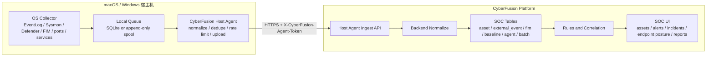

# CyberFusion Host Agent macOS / Windows 同步建设计划

本文档定义 CyberFusion 从演示数据走向真实主机安全数据采集的自研 Host Agent 路线。核心原则是：macOS 用来快速开发和验证，Windows 作为最终交付重点，两端必须共享同一协议、同一数据模型、同一入库链路和同一验收口径。

## 目标边界

当前平台在没有 Host Agent 时只能展示种子数据、导入数据或演示数据。浏览器和后端服务本身不能自动读取本机真实安全事件，Docker 容器也不能直接读取 Windows 宿主机的 EventLog、Defender、Sysmon、服务和本机文件变更。因此真实化建设必须新增宿主机侧采集器。

目标：

- 自研轻量 Host Agent，先处理结构化文本元数据，不上传文件正文、浏览器 Cookie、私钥、访问令牌或用户文档。
- macOS 与 Windows 使用同一套 `Host Agent Ingest v1` API。
- 后端只负责接收、认证、归一化、幂等、入库、规则命中、关联和展示，不反向执行宿主机命令。
- Windows 未来即使用 Docker 跑平台服务，Agent 仍作为 Windows Service 跑在宿主机上，再把数据送入 Docker 内的后端 API。
- macOS 开发环境必须能跑同一套 fixture 和本机采集子集，用来提前验证协议和页面链路。

非目标：

- 不做远程控制、远程 shell、自动处置命令下发。
- 不做全盘文件内容扫描。
- 不把运行数据、队列、缓存或密钥写入源码目录。
- 不依赖 WSL 作为 Windows 必需条件。

## 总体架构



## 双平台同步策略

| 层级 | macOS 开发路径 | Windows 交付路径 | 同步规则 |
| --- | --- | --- | --- |
| 协议 | `Host Agent Ingest v1` | `Host Agent Ingest v1` | 字段、状态码、幂等语义完全一致 |
| Agent 形态 | CLI + launchd 后台模式 | Windows Service + CLI 诊断模式 | 共享 core，OS collector 分层 |
| 平台运行 | macOS Docker/MySQL/Redis 或本机开发 | Windows Docker 承载平台服务，Agent 在宿主机 | 后端 API 不关心 Agent 所在 OS |
| 验证数据 | macOS fixture + 本机轻采集 | Windows fixture + 真实 EventLog/Sysmon/Defender | fixture 只用于协议验收，清理后不得残留到业务视图 |
| 运行目录 | `/Users/zhangjiyan/Environment/...` | `%CYBERFUSION_ENV_ROOT%\agent` | 不写源码目录 |
| 密钥存储 | 开发期 env/config，后续 Keychain | Windows Credential Manager 或 DPAPI | 服务端只存 token hash |

## 当前 Phase 0 已完成的基础能力

后端已具备第一版 Host Agent 接入底座：

- `POST /api/soc/agents/register`：管理员或 `soc:agent:register` 权限注册 Agent，返回一次性 agent token。
- `POST /api/soc/agents/heartbeat`：Agent 心跳。
- `GET /api/soc/agents`：查看 Agent 状态。
- `POST /api/soc/ingest/host/assets`：资产事实入库到 `soc_asset`。
- `POST /api/soc/ingest/host/events`：主机事件入库到 `soc_external_event`。
- `POST /api/soc/ingest/host/fim`：文件完整性事件入库到 `soc_file_integrity_event`。
- `POST /api/soc/ingest/host/baseline`：基线结果入库到 `soc_baseline_check`。
- `eventUid` 幂等：重复上报计为 duplicate，不重复插入。
- 新增 `soc_host_agent`、`soc_ingest_batch`、`soc_ingest_reject_log`。
- 新增 `soc:agent:view`、`soc:agent:register` 权限。
- `scripts/smoke/host-agent-ingest-smoke.sh` 可以同时验证 macOS 和 Windows fixture。

## 自研 Agent 技术选型

建议使用 Go 实现 Agent：

- 单二进制交付，Windows Service 和 macOS launchd 支持成熟。
- 内存占用和启动速度适合常驻文本采集。
- 跨平台网络、队列、JSON、压缩、TLS 支持直接。
- Windows Event Log、服务、端口、进程等采集生态比 Java 前端项目更轻。

模块划分：

| 模块 | 职责 |
| --- | --- |
| `agent/core` | 配置、注册、心跳、token、上传、重试、限速、日志、队列 |
| `agent/schema` | 与后端 `Host Agent Ingest v1` 对齐的数据结构 |
| `agent/collectors/common` | 主机名、IP、MAC、OS、进程、端口、服务、磁盘摘要 |
| `agent/collectors/macos` | launchd、系统日志摘要、文件完整性、登录/权限变更摘要 |
| `agent/collectors/windows` | EventLog、Sysmon、Defender、补丁摘要、服务、计划任务、端口、文件完整性 |
| `agent/tests/fixtures` | macOS / Windows 统一 fixture 和回放 |
| `agent/install` | macOS launchd plist、Windows Service install/uninstall |

## 采集范围分期

### Phase 1: 文本元数据最小闭环

采集：

- 主机资产：hostname、OS、版本、架构、IP、MAC、Agent 版本。
- 端口和进程摘要：监听端口、进程名、PID、启动用户，默认不采集命令行完整参数。
- 服务状态：Windows Service / macOS launch daemon 名称、状态、启动类型。
- 文件完整性：仅监控配置路径的路径、动作、hash、时间，不上传文件内容。
- 基线检查：防火墙、自动更新、防护软件状态、关键服务状态。
- Agent 心跳：版本、队列长度、最后上传时间、错误摘要。

验收：

- macOS fixture 和 Windows fixture 都能通过同一 smoke；fixture 只允许作为临时验证数据，smoke 结束后必须清理。
- 真实 macOS 主机能至少产生资产、端口、FIM、基线四类记录。
- Windows 目标机能至少产生资产、EventLog、服务、FIM、基线五类记录。
- UI 资产视图、员工终端态势、FIM、基线、事件簇只能显示真实主机来源：macOS 数据来自真实 Mac Agent，Windows 数据来自真实 Windows 宿主机 Agent。

### Phase 2: Windows 安全信号增强

采集：

- Windows Security EventLog：登录成功/失败、账户锁定、权限变更、服务安装、计划任务变更。
- Sysmon：如果已安装 Sysmon，采集进程创建、网络连接、文件创建时间变更等文本事件。
- Microsoft Defender：防护状态、检测事件、隔离事件、签名版本。
- 关键注册表和启动项变更摘要。

验收：

- Windows Docker 平台后端能接收 Windows Service Agent 上报的数据。
- 关停 Docker 后端时，Agent 本地队列积压；后端恢复后自动补传。
- 重复 EventRecordID 或稳定 `eventUid` 不重复入库。
- 规则中心能基于 Windows failed logon、service installed、Defender detection 生成告警或事件簇。

### Phase 3: 运营闭环

能力：

- Agent 管理页：在线/离线、版本、队列、错误、最后数据时间。
- 终端详情页：资产事实、风险分、最近事件、FIM、基线、处置记录。
- 规则联动：主机事件命中规则后进入告警、事件簇、工单和报表。
- 降噪：同一主机、同一规则、同一时间窗合并。
- 数据保留：原始结构化摘要短期留存，归一化对象长期留存。

验收：

- 从 Windows failed logon 或 Defender detection 到告警、事件簇、工单、报表形成可追踪链路。
- 从终端详情可以反查原始批次、Agent、规则和处置记录。
- 页面不再依赖演示数据也能展示当前主机安全态势。

### Phase 4: 工程化交付

能力：

- Windows MSI 或 signed exe 安装包。
- macOS pkg 或签名二进制。
- Agent 自动升级策略，灰度版本和回滚。
- 多租户/多环境 enrollment。
- 离线安装包和内网部署文档。

验收：

- Windows 标准用户无法读取 Agent token。
- 卸载后服务、计划任务、运行目录和日志处理符合配置策略。
- 升级不中断本地队列，不丢失未上传数据。

## 资源预估

因为只处理结构化文本元数据，自研 Agent 不需要很大资源。建议先按保守上限设计和验收：

| 项 | 自研 Agent 目标 | 说明 |
| --- | --- | --- |
| 安装占用 | 50-150 MB | 单二进制、配置、证书、少量依赖 |
| 本地队列 | 默认 256-1024 MB 上限 | 网络中断时保存待上传 JSON 批次，超过上限按策略丢弃低价值重复事件 |
| 日志 | 默认 100-300 MB 滚动 | 只记录运行摘要和错误，不记录敏感原文 |
| 常驻内存 | 30-120 MB | 文本采集和批量上传目标范围 |
| 峰值内存 | 150-300 MB | 大批量 EventLog 或 FIM 扫描时的软上限 |
| CPU | 空闲低于 1%，采集峰值低于 5% | 采集周期和限速可配置 |
| 网络 | 批量 gzip JSON，默认每 30-60 秒上传 | 失败退避，避免压垮后端 |

当前已新增 `scripts/smoke/host-agent-resource-smoke.sh` 作为 Mac 开发侧资源预检：脚本会先构建真实 Agent 二进制，验证 fixture dry-run 可执行，再检查 bounded daemon outage loop 的 Go runtime memory stats，默认阈值为 `CYBERFUSION_AGENT_MAX_RUNTIME_SYS_MB=100`。它只能证明短路径 Go runtime 内存包络未越界；OS RSS、Windows working set、长期空闲 CPU 低于 1% 和 30 分钟断网队列膨胀，仍必须在真实 launchd / Windows Service 环境中观测。

Wazuh Agent 可以作为对照或兼容接入源，不作为第一阶段自研 Agent 的替代。若后续接入 Wazuh，建议只启用必要的 EventLog/Sysmon/FIM/基线项，并通过集中配置限制噪声路径、日志级别和上传频率。具体 Wazuh 配置键和推荐值必须在确定版本后复核官方文档并实机压测。

## Windows Docker 目标部署方式

Windows 上的正确边界：

- Docker 容器内运行 MySQL、Redis、后端、前端等平台服务。
- Host Agent 运行在 Windows 宿主机，作为 Windows Service。
- Agent 上报到 `http://127.0.0.1:<backend-port>/api` 或内网 HTTPS 地址。
- Agent 运行目录位于 `%CYBERFUSION_ENV_ROOT%\agent`，包含配置、队列、日志和本机证据。
- Docker volume 只保存平台数据，不保存 Agent 私钥或宿主机采集缓存。

原因：

- Linux 容器无法天然读取 Windows 宿主机 EventLog。
- Docker Desktop 的容器文件系统不是 Windows 主机真实系统视角。
- 安全软件、Defender、Sysmon 和服务状态必须由宿主机权限读取。

## 安全控制

- Agent 注册 token 只返回一次，服务端只保存 BCrypt hash。
- Agent 上传使用 `X-CyberFusion-Agent-Token`，后续升级为 mTLS 或短期 token。
- API 只接受 JSON 元数据，不接受文件正文。
- 后端不执行 Agent 上报的命令字段，也不信任客户端风险分。
- 所有上报都写入 `soc_ingest_batch`，便于追踪、重放和审计。
- Agent 本地队列加权限控制；Windows 使用 DPAPI 或 Credential Manager，macOS 使用 Keychain。
- 采集器默认最小权限运行，需要更高权限的采集项必须显式启用。

## 验收矩阵

| 验收项 | macOS | Windows Docker 目标 |
| --- | --- | --- |
| 后端启动 | `/api/health` UP | `/api/health` UP |
| Agent 注册 | admin 注册 macOS agent | admin 注册 Windows agent |
| 心跳 | 1 分钟内在线 | 1 分钟内在线 |
| 资产 | `macos-agent` 写入 `soc_asset` | `windows-agent` 写入 `soc_asset` |
| 事件 | 系统日志/端口/进程摘要写入 `soc_external_event` | EventLog/Sysmon/Defender 写入 `soc_external_event` |
| FIM | 监控测试配置文件变更 | 监控测试配置文件变更 |
| 基线 | 防火墙/更新/关键服务摘要 | Defender/防火墙/更新/关键服务摘要 |
| 幂等 | 重复 `eventUid` 不重复插入 | 重复 `eventUid` 不重复插入 |
| 队列 | 后端断开后积压，恢复后补传 | 后端断开后积压，恢复后补传 |
| UI | 资产、FIM、基线、事件簇可见 | 资产、告警、事件簇、工单可见 |
| 敏感数据 | 不上传文件内容和凭据 | 不上传文件内容和凭据 |

## 近期任务清单

1. 后端 Phase 0 收口
   - 保持 `Host Agent Ingest v1` API 稳定。
   - 增加 Agent 列表分页、详情和批次查询接口。
   - 将 Agent 状态接入员工终端态势和资产详情。

2. Agent 原型
   - 已建立 `agent/` Go workspace。
   - 已完成配置加载、统一 schema、上传客户端、运行日志、本地 pending 队列、eventUid 去重状态、限流 flush、macOS/Windows fixture 回放和 bounded daemon 模式。
   - 已补 pending 队列本地去重保护；当新的资产、事件、FIM 或基线操作的全部 dedupe key 已经在 pending 队列里时，本地跳过重复入队，降低后端停机窗口内的队列膨胀。
   - 已补 post-flush 心跳，队列补传完成后会回写 `queueDepth`、`queueBytes`、`sentCount` 和 `failedCount`，让页面和验收脚本能看到补传结果。
   - 已补 macOS / Windows 对称卸载脚本；默认移除服务、二进制和本地 token 配置，但保留 `runtime/queue`，不连接或修改平台数据库。
   - 已补 `scripts/mac/package-agent.sh`，可在 Mac 开发机交叉构建 macOS/Windows zip 包；包内只包含二进制、安装脚本、文档和 manifest，不包含 token、`agent.env`、运行日志或 pending 队列。
   - Windows Service 与 macOS launchd 均使用 `--once=false --interval 60s` 长跑模式；上传失败时保留本地队列，下一周期重试。
   - 下一步补长时间队列保留策略压测、OS 深度 collector、MSI/pkg 或签名安装器、升级包和受保护凭据存储。

3. macOS 开发采集
   - 已采集资产、监听端口、进程摘要、launchd 启动项摘要、系统日志摘要、FIM hash、Agent 运行状态、macOS 防火墙、远程登录状态和被监控文件权限基线。
   - 已补 `scripts/mac/install-agent.sh`、`start-agent.sh`、`verify-agent.sh`、`uninstall-agent.sh`，可生成二进制、本地配置、运行目录和 launchd plist，并可卸载 launchd 与本地二进制。
   - 已使用本机开发后端验证真实 Mac 数据入库。
   - 下一步补 LaunchDaemon 权限策略和登录/审计日志的更细归一化。

4. Windows 真实采集
   - 已补 `scripts/win/install-agent.ps1`、`start-agent.ps1`、`verify-agent.ps1`、`uninstall-agent.ps1` 的 Windows Service 安装、daemon 启动、验证和卸载骨架。
   - 已补 Go Agent Windows collector：Security/System/Application EventLog、PowerShell Operational、Defender Operational、Sysmon optional、补丁摘要、服务摘要、监听端口摘要、自启动项摘要、Defender 服务基线、Windows 防火墙基线和 FIM。
   - 下一步需要在 Windows Docker 主环境实机运行，验证 `127.0.0.1:18080` 上报、重启自恢复和队列补传。

5. 验收脚本
   - 保留 `scripts/smoke/host-agent-ingest-smoke.sh` 作为 macOS/Linux smoke。
   - 使用 `scripts/smoke/host-agent-go-smoke.sh` 验证 Go Agent 双平台 fixture 上报。
   - 使用 `scripts/smoke/host-agent-queue-replay-smoke.sh` 在 Mac 开发环境模拟后端不可达后恢复，验证本地 pending 队列补传和 post-flush 心跳统计。
   - 使用 `scripts/smoke/host-agent-uninstall-smoke.sh` 验证 macOS 卸载默认移除二进制和 token 配置，但保留 pending 队列。
   - 使用 `scripts/smoke/host-agent-mac-collect-smoke.sh` 验证当前 Mac 真实采集上报。
   - 使用 `scripts/smoke/host-agent-resource-smoke.sh` 验证 Agent 二进制可完成 fixture dry-run，并在 bounded daemon outage loop 下 Go runtime memory stats 不超过当前阈值。
   - 使用 `scripts/smoke/host-agent-package-smoke.sh` 验证 macOS/Windows zip 包可生成，且不夹带 token 配置、运行目录或 pending 队列。
   - 使用 `scripts/smoke/host-agent-mac-windows-preflight.sh` 在没有 Windows 实机时验证 Go Agent 双平台构建、fixture 上报、短时队列补传、卸载保留队列、交付包生成、后端入库和 Agent 管理页数据源可见性。
   - 使用 `scripts/win/host-agent-go-smoke.ps1` 在 Windows 侧验证同一 Go Agent fixture。
   - 使用 `scripts/win/verify-agent.ps1` 在 Windows 侧验证服务状态、API 连通、配置和一次性真实上报。

## 当前可执行校验

当前没有 Windows 主机可用时，验收边界必须明确拆开：

- 当前可验收：macOS 真实采集进入资产、事件、FIM、基线，并继续打通告警、事件簇、工单和报表闭环。
- 当前可预检：Windows Agent 交叉构建、fixture 协议回放、安装脚本和交付包结构。
- 当前不可宣称完成：Windows EventLog、Defender、Sysmon、Windows Service、主机重启自恢复、Windows Docker 宿主机到后端的真实上报，以及 30 分钟停机后的 Windows 本地队列补传。
- 没有 Windows 实机时，`windows-agent` 只能作为 fixture 执行窗口内的临时来源；清理门禁通过后，业务页面不应保留伪造 Windows 主机、告警、事件簇、工单或报表。

macOS/Linux 开发环境：

```bash
curl -sS http://127.0.0.1:18080/api/health
scripts/smoke/host-agent-ingest-smoke.sh --api-base-url http://127.0.0.1:18080/api
scripts/smoke/host-agent-go-smoke.sh
scripts/smoke/host-agent-fixture-residue-gate.sh --clear-first
scripts/smoke/host-agent-queue-replay-smoke.sh
scripts/smoke/host-agent-uninstall-smoke.sh
scripts/smoke/host-agent-mac-collect-smoke.sh
scripts/smoke/host-agent-fixture-residue-gate.sh
scripts/smoke/host-agent-resource-smoke.sh
scripts/mac/package-agent.sh
scripts/smoke/host-agent-package-smoke.sh
scripts/smoke/host-agent-mac-windows-preflight.sh
CYBERFUSION_ENV_ROOT=/private/tmp/cyberfusion-agent-install-check \
CYBERFUSION_AGENT_ID=macos-install-check \
CYBERFUSION_ADMIN_ACCESS_TOKEN="$LOCAL_ADMIN_ACCESS_TOKEN" \
CYBERFUSION_SKIP_LAUNCHD_INSTALL=1 \
scripts/mac/install-agent.sh
CYBERFUSION_ENV_ROOT=/private/tmp/cyberfusion-agent-install-check \
CYBERFUSION_AGENT_ID=macos-install-check \
CYBERFUSION_AGENT_UPLOAD_ONCE=1 \
scripts/mac/verify-agent.sh
CYBERFUSION_ENV_ROOT=/private/tmp/cyberfusion-agent-install-check \
CYBERFUSION_AGENT_ID=macos-install-check \
scripts/mac/uninstall-agent.sh
```

Windows 目标环境后续应提供等价 PowerShell：

```powershell
Invoke-RestMethod -Uri "http://127.0.0.1:18080/api/health"
.\scripts\win\host-agent-go-smoke.ps1
.\scripts\win\host-agent-fixture-residue-gate.ps1 -ClearFirst
.\scripts\win\install-agent.ps1 -AgentId "windows-dev-agent"
.\scripts\win\start-agent.ps1 -AgentId "windows-dev-agent"
.\scripts\win\verify-agent.ps1 -AgentId "windows-dev-agent" -UploadOnce
.\scripts\win\uninstall-agent.ps1 -AgentId "windows-dev-agent"
```

当前通过标准：

- smoke 全部 PASS。
- `host-agent-mac-windows-preflight.sh` 只作为 Mac 侧预检：它必须能交叉编译 Windows agent、短暂完成 macOS/windows fixture 上报，随后清理 fixture 并通过 `host-agent-fixture-residue-gate.sh`。
- `host-agent-fixture-residue-gate.sh` / `host-agent-fixture-residue-gate.ps1` 必须证明 SOC API 中没有 fixture agent、TEST-NET 资产、smoke batch、fixture 告警、事件簇或事件残留。
- `host-agent-queue-replay-smoke.sh` 必须证明后端不可达时 pending 队列保留，后端恢复后队列清空，并且 Agent 心跳显示 `queueDepth=0` 与非零 `sentCount`。
- Go 单测必须覆盖 pending 队列的 dedupe key 行为：全量重复 key 跳过入队，混合新 key 继续保留，失败 flush 保留本地操作，恢复 flush 后队列清空并写入 dedupe state。
- `host-agent-uninstall-smoke.sh` 必须证明卸载默认不会删除 pending 队列，也不会访问平台数据库。
- `host-agent-resource-smoke.sh` 必须证明真实 Agent 二进制可完成 fixture dry-run，并在 bounded daemon outage loop 中 Go runtime Sys 不超过 `CYBERFUSION_AGENT_MAX_RUNTIME_SYS_MB`，默认 100 MB。
- `host-agent-package-smoke.sh` 必须证明 macOS/Windows zip 包存在 checksum、manifest 和安装脚本，且不包含 `agent.env`、token、`runtime/` 或 `queue/`。
- Mac 真实采集 smoke 后，`soc_asset` 出现当前 Mac 主机，`soc_external_event` 出现 `listening_port_observed`，`soc_file_integrity_event` 出现 FIM hash，`soc_baseline_check` 出现 macOS 基线。
- 没有 Windows 实机时，页面和数据库不得出现伪造的 Windows 主机资产、告警、事件簇或工单；`windows-agent` 只允许在 fixture smoke 执行窗口内短暂可见，清理门禁通过后必须消失。
- 重复上报只增加 duplicate 计数，不重复插入事件。
- UI 可从资产或终端态势进入 Host Agent 产生的数据链路。

Windows 实机预留通过标准：

- `scripts/win/verify-agent.ps1 -UploadOnce` 后，`soc_asset` 出现真实 Windows 主机，`soc_external_event` 出现 Windows EventLog/Defender/补丁/服务/端口摘要，`soc_file_integrity_event` 出现 FIM hash，`soc_baseline_check` 出现 Windows Defender/防火墙基线。
- Windows failed logon、service installed 或 Defender detection 可以进入告警、事件簇、工单和报表。
- Windows Service 重启后自动恢复心跳和上传。
- Docker 后端停机 30 分钟后，Windows Agent 本地队列可积压；后端恢复后自动补传，且重复 EventRecordID 或稳定 `eventUid` 不重复入库。
- 通过这些 Windows 实机证据前，所有 Windows 页面状态都只能显示为预留或待复核，不能显示为已完成。

边界：

- 预检脚本不能替代 Windows 实机验收；真实 EventLog、Defender、Sysmon、Windows Service、主机重启自恢复和 Docker 后端停机 30 分钟后的队列补传，仍必须在 Windows 宿主机上执行 `scripts/win/verify-agent.ps1` 和停机恢复测试。
- 当前 Windows zip 不是 MSI，也没有完成签名安装和真实 Windows Service 验收；它只证明跨平台构建和交付目录结构正确。
